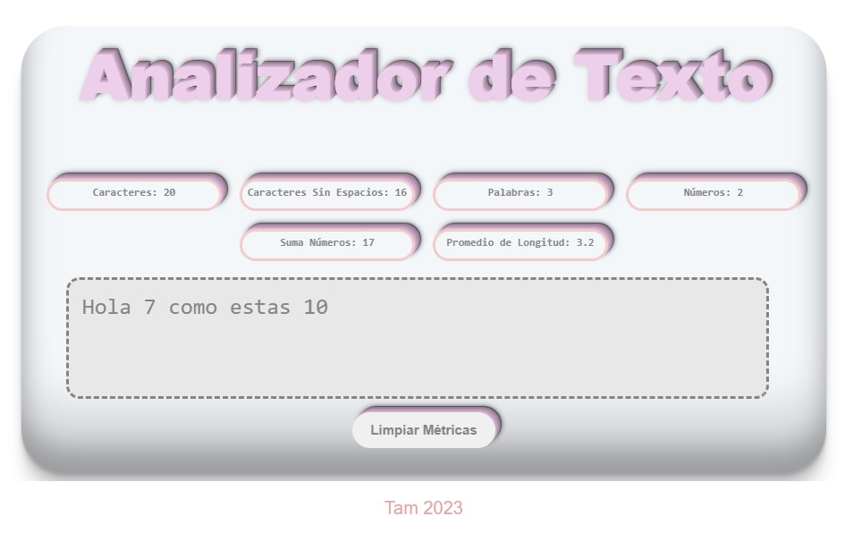

# Analizador de Texto

Este proyecto es un simple analizador de texto desarrollado con HTML, CSS y JavaScript puro.
Proporciona una interfaz de usuario intuitiva para ingresar texto y obtener estadísticas básicas sobre el contenido.

## Funcionalidades

1. **Entrada de Texto Interactiva:**
   - La aplicación permite a la usuaria ingresar texto escribiéndolo en un cuadro de texto.

2. **Análisis en Tiempo Real:*
   - **Recuento de Palabras:** Muestra el número de palabras en el texto de entrada en tiempo real.
   - **Recuento de Caracteres:** Muestra el número total de caracteres, incluyendo espacios y signos de puntuación.
   - **Recuento de Caracteres (sin espacios y puntuación):** Muestra el número de caracteres excluyendo espacios y signos de puntuación.
   - **Recuento de Números:** Cuenta la cantidad de números en el texto de entrada.
   - **Suma Total de Números:** Calcula la suma de todos los números presentes en el texto.
   - **Longitud Media de Palabras:** Calcula y muestra la longitud media de las palabras en el texto.

3. **Limpieza del Contenido:**
   - La aplicación permite limpiar el contenido de la caja de texto haciendo clic en un botón.

## Tecnologías Utilizadas

- **HTML:** La estructura básica de la aplicación.
- **CSS:** Estilos para una interfaz atractiva y responsive.
- **JavaScript:** Lógica de la aplicación para el análisis de texto en tiempo real.

1. ## Cómo Usar

1. Clona este repositorio: `git clone https://github.com/tamaracontreras/DEV012-text-analyzer.git`
2. Abre el archivo `index.html` en tu navegador.

**Opción Alternativa:**

Si no deseas clonar el repositorio y simplemente quieres probar la aplicación en línea, puedes acceder a la versión desplegada en GitHub Pages.

[**Analizador de Texto en GitHub Pages**](https://tamaracontreras.github.io/DEV012-text-analyzer/)

Esto te permitirá acceder y utilizar la aplicación directamente en tu navegador sin necesidad de clonar el repositorio localmente.

## Capturas de Pantalla

## Contribuir

Si deseas contribuir a este proyecto, sigue estos pasos:

1. Haz un fork del repositorio.
2. Crea una rama para tu función: `git checkout -b nueva-funcion`.
3. Realiza tus cambios y haz commit: `git commit -m 'Agrega nueva función'`.
4. Sube tus cambios: `git push origin nueva-funcion`.
5. Abre un pull request en GitHub.

## Licencia

Este proyecto está bajo la Licencia MIT. Consulta el archivo [LICENSE](LICENSE) para más detalles.

## Contacto

Si tienes preguntas o sugerencias, no dudes en contactarme:

- Email: tacs.laboral@gmail.com
- Slack: [@Tam]
-Codepen [http://www.codepen.io/tam_u]

¡Gracias por contribuir!
